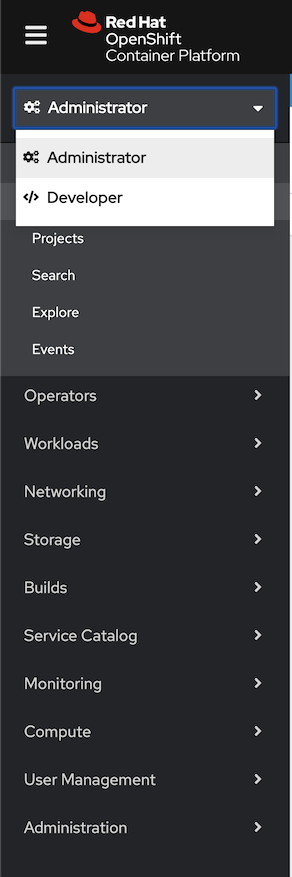
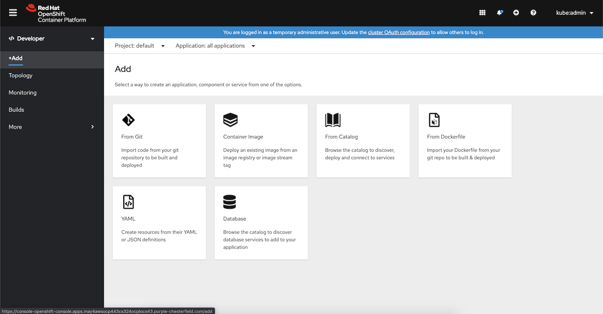
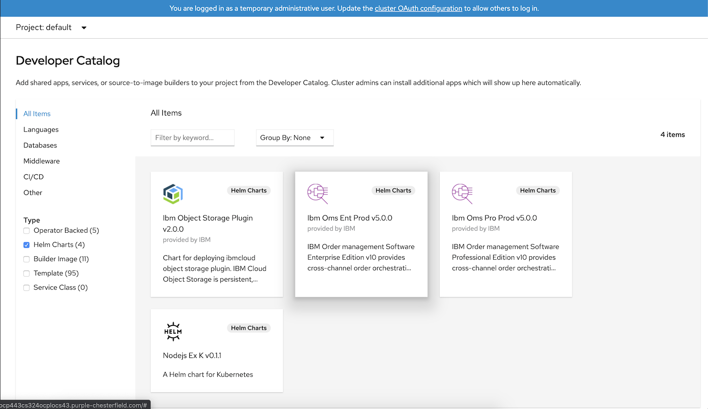
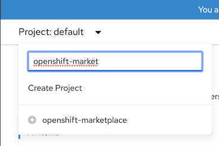

### Red Hat Catalog Enablement for the IBM Operator Catalog

IBM provides a catalog of product offerings in the form of a `catalog index image`.  The catalog image can be incepted on a Red Hat OpenShift 4.x cluster via a `CatalogSource` resource, in order to show IBM offerings in the Red Hat OpenShift operator catalog.  

#### Command Line Enablement

The catalog can be incepted by applying the following YAML file to the OpenShift cluster:

```yaml
apiVersion: operators.coreos.com/v1alpha1
kind: CatalogSource
metadata:
  name: ibm-operator-catalog
  namespace: openshift-marketplace
spec:
  displayName: ibm-operator-catalog 
  publisher: IBM Content
  sourceType: grpc
  image: docker.io/ibmcom/ibm-operator-catalog
  updateStrategy:
    registryPoll:
      interval: 45m
```

Command Line: `$ oc apply -f catalog_source.yaml -n openshift-marketplace`

**Verify the Command Line Install:**

```
$ oc get CatalogSources ibm-operator-catalog -n openshift-marketplace
```

This will give you the following on error: `Error from server (NotFound): catalogsources.operators.coreos.com "ibm-operator-catalog" not found`

This will give you the following on success: 
```
NAME                   DISPLAY                 TYPE   PUBLISHER      AGE
ibm-operator-catalog   ibm-operator-catalog    grpc   IBM Content    9d
```

#### Helm Chart Enablement

**Further Instructions Pending**

IBM provides a Helm Chart in the Red Hat OpenShift Helm Catalog to install the operator catalog to the OpenShift cluster.  Locate the Helm Chart in the catalog and install to the cluster.   (instructions coming on how to locate and install the chart).

**Steps:**

1. Log into your OCP UI instance
2. Select the `developer` view



3. Go to the add section of the `develpoer` view and select `from catalog`



4. Select the filter options to filter for Helm Charts only



5. Select the project/namespace to be `openshift-marketplace`



6. Find the `ibm-operator-catalog-enablement` Helm Chart and select the tile
7. Click the `Install Helm Chart` button