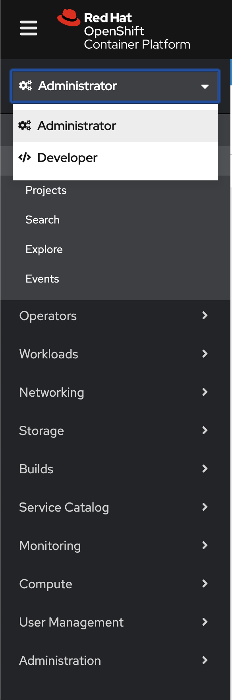
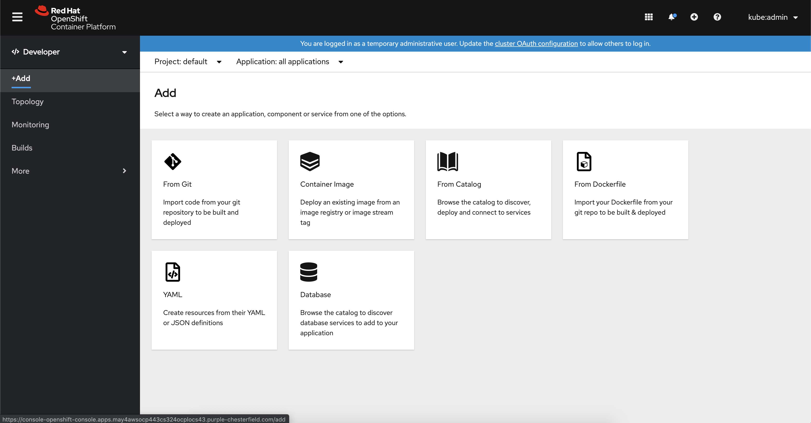
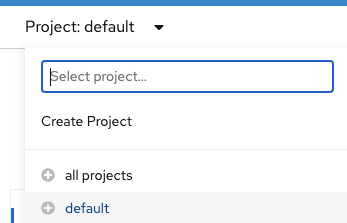
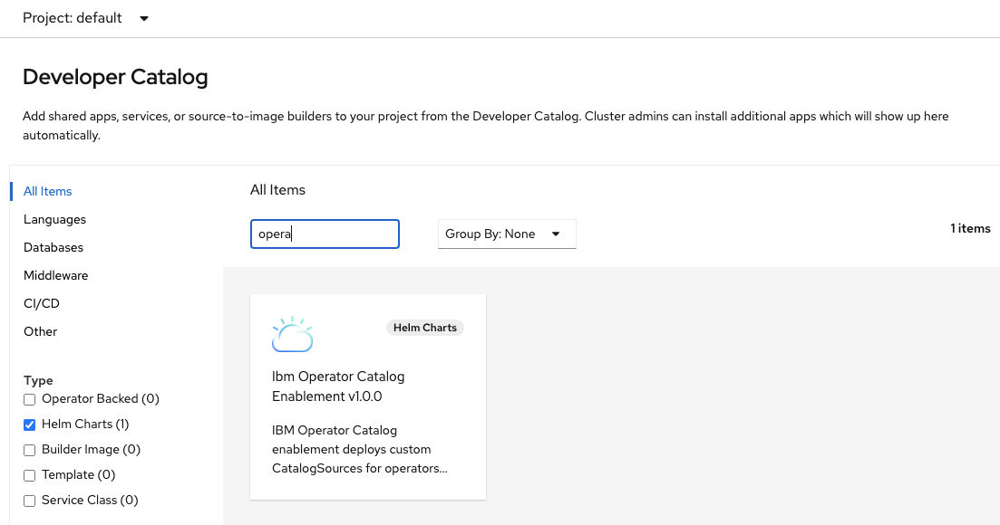
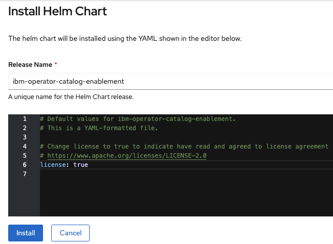

# Red Hat Catalog Enablement for the IBM Operator Catalog

IBM provides a catalog of product offerings in the form of a `catalog index image`.  The catalog image can be enabled on a Red Hat OpenShift 4.4 or later cluster via a `CatalogSource` resource, in order to show IBM offerings in the Red Hat OpenShift operator catalog.  

### Command Line Enablement

The catalog can be enabled by applying the following YAML file to the OpenShift cluster:

```yaml
apiVersion: operators.coreos.com/v1alpha1
kind: CatalogSource
metadata:
  name: ibm-operator-catalog
  namespace: openshift-marketplace
spec:
  displayName: IBM Operator Catalog
  publisher: IBM
  sourceType: grpc
  image: docker.io/ibmcom/ibm-operator-catalog
  updateStrategy:
    registryPoll:
      interval: 45m
```

Command Line: `$ oc apply -f catalog_source.yaml -n openshift-marketplace`

### Verify the Command Line Install

```
$ oc get CatalogSources ibm-operator-catalog -n openshift-marketplace
```

This will give you the following on error:
```
Error from server (NotFound): catalogsources.operators.coreos.com "ibm-operator-catalog" not found
```

This will give you the following on success: 
```
$ oc get CatalogSources ibm-operator-catalog -n openshift-marketplace
NAME                   DISPLAY                TYPE   PUBLISHER   AGE
ibm-operator-catalog   IBM Operator Catalog   grpc   IBM         28s
```

### Additional Support

For additional support related to Cloud Paks and Container Software please reference [the general support documentation](https://www.ibm.com/support/knowledgecenter/en/cloudpaks).

### Helm Chart Enablement

1. Log into your OCP UI instance
2. Select the Developer view



3. Go to the add section of the Developer view and select From Catalog



4. Select the project/namespace for helm releasee to be installed



5. Select Type of 'Helm Charts' and enter search criteria of 'operator '



6. Click the 'Ibm Operator Catalog' tile
7. Click the Install Helm Chart button
8. Enter true to accept license



9. Click Install
